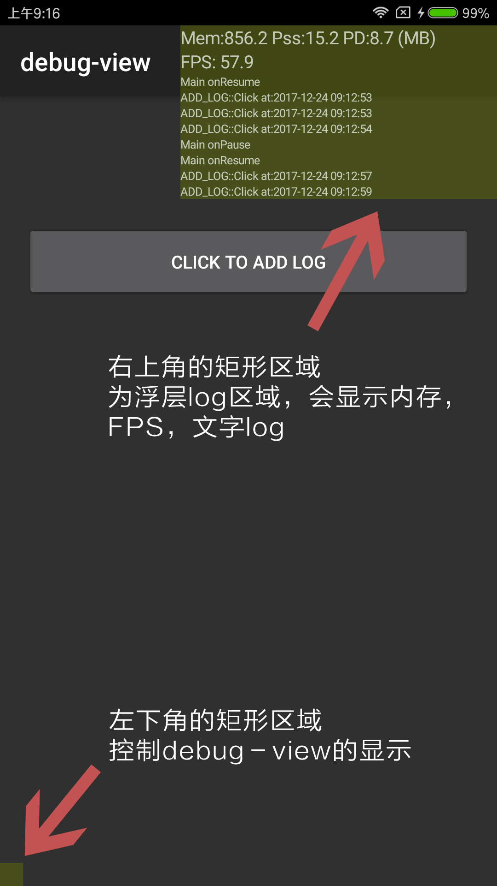

debug_view_kotlin
=================

Debug-View是用Kotlin实现的用于Android调试的**浮层调试控制台**，这个控制台会一直浮在app的UI最上层，
用于实时地、直观地显示app的性能指标和日志信息：App使用的内存信息、App的实时帧率FPS、app启动时间、Activity启动时间、文字log信息。

- 推荐项目[kotlin_tips](https://github.com/heimashi/kotlin_tips)，用Kotlin去提高生产力:汇总Kotlin相对于Java的优势，以及怎么用Kotlin去简洁、务实、高效、安全开发的Tips
- 推荐项目[easy_mock_api](https://github.com/heimashi/easy_mock_api)，给客户端同学的模拟json接口的小工具
- 推荐项目[CompatWebView](https://github.com/heimashi/CompatWebView)，CompatWebView is used to fix addJavascriptInterface below Android 4.2


How to use
----------


- 开启浮层权限：在App首次启动时，Debug-View可能会去请求开启浮层权限，开启后才能显示控制台
- 浮层Debug-View的区域说明：
    - 如上图所示，浮层分为两个部分：左下角的矩形区域为控制区域，右上角的大矩形区域为显示日志区域，该区域不接收点击事件和焦点，会显示如下三种信息：
        - 内存信息：Mem为手机剩余内存、Pss为应用所使用的总内存（包括共有的）、PD为应用的TotalPrivateDirty内存（私有的）
        - 帧率FPS：手机的实时帧率FPS
        - 启动时间：App启动时间以及Activity启动时间
        - 文字Log：通过LogModule.instance.log("msg...")向浮层控制台输出任意日志
    - 浮层的控制说明
        - 点击左下角的控制区域（短按），会清空日志控制台信息
        - 长按左下角的控制区域（长按），会隐藏或者显示右上角的浮层控制台


How to import
-------------
- 对于已经支持kotlin的项目,在Application的module里添加依赖即可
```groovy
   dependencies {
     debugImplementation 'com.sw.debug.view:debug-view:1.0.2'
     releaseImplementation 'com.sw.debug.view:debug-view-no-op:1.0.2'
     testImplementation 'com.sw.debug.view:debug-view-no-op:1.0.2'
   }
```
如果是java项目需要先添加kotlin的支持，步骤是在Android Studio中选择tools ---> kotlin ---> Configure Kotlin in Project

- 初始化，建议在应用的Application中，初始化后debug-view就会生成一个浮层View显示内存和FPS
```kotlin
    private fun initDebugView() {
        DebugViewWrapper.instance.init(
                DebugViewWrapper.Builder(this)
                        .viewWidth(250) /* the width of debug-view */
                        .bgColor(0x6f677700) /* the color of debug-view */
                        .alwaysShowOverlaySetting(true) /* the flag for always showing Overlay Setting */
                        .logMaxLines(20) /* the max lines of log */
        )


        DebugViewWrapper.instance.show()
    }
```

- 自定义输出文字log到浮层控制台中
```kotlin
    LogModule.instance.log("some msg...")
```

- 统计应用的启动时间（详细见example案例）
    - 一般以Application中的attachBaseContext()作为应用启动的开始点，故在attachBaseContext()方法中调用
    ```kotlin
      TimerModule.instance.begin(application)
    ```
    - 一般以主页显示出来作为应用启动的结束点，故在MainActivity中的onWindowFocusChanged()函数中调用（不要在Activity的onResume中调用，此时Activity还未完全显示）
    ```kotlin
      override fun onWindowFocusChanged(hasFocus: Boolean) {
          super.onWindowFocusChanged(hasFocus)
          if(hasFocus){
              TimerModule.instance.end(application)
          }
      }
    ```

- 统计Activity的启动时间
    - 一般项目中都有BaseActivity，以BaseActivity的onCreate作为启动的开始点：
    ```kotlin
       TimerModule.instance.begin(this)
    ```
    - 同理在BaseActivity的onWindowFocusChanged()作为启动的结束点：
    ```kotlin
    override fun onWindowFocusChanged(hasFocus: Boolean) {
        super.onWindowFocusChanged(hasFocus)
        if(hasFocus){
            TimerModule.instance.end(this)
        }
    }
    ```